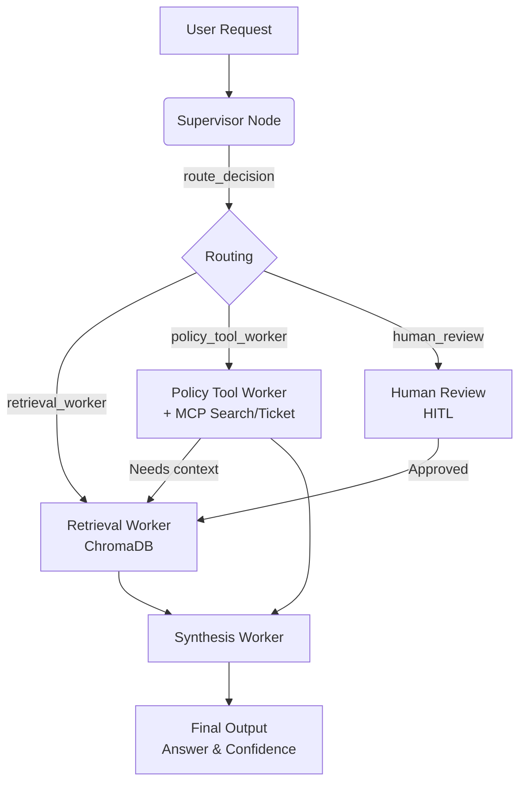

# System Architecture — Lab Day 09

**Nhóm:** Nhóm 36
**Ngày:** 2026-04-14  
**Version:** 1.0

---

## 1. Tổng quan kiến trúc

> Mô tả ngắn hệ thống của nhóm: chọn pattern gì, gồm những thành phần nào.

**Pattern đã chọn:** Supervisor-Worker  
**Lý do chọn pattern này (thay vì single agent):**

Hệ thống RAG cơ bản (single agent) của Day 08 đang thực hiện quá nhiều nhiệm vụ trong một quy trình duy nhất (retrieve, kiểm tra policy, tổng hợp). Việc tách thành Supervisor-Worker giúp hệ thống phân tách rõ vai trò, dễ dàng theo dõi (trace) lỗi thuộc về thành phần nào, và dễ dàng mở rộng (ví dụ thêm MCP tools) mà không ảnh hưởng tới toàn bộ hệ thống. Supervisor điều phối luồng xử lý, còn các Worker tập trung hoàn thành một nhiệm vụ riêng lẻ một cách hiệu quả.

---

## 2. Sơ đồ Pipeline

> Vẽ sơ đồ pipeline dưới dạng text, Mermaid diagram, hoặc ASCII art.
> Yêu cầu tối thiểu: thể hiện rõ luồng từ input → supervisor → workers → output.

**Sơ đồ thực tế của nhóm:**

---

## 3. Vai trò từng thành phần

### Supervisor (`graph.py`)

| Thuộc tính         | Mô tả                                                                                                                                                     |
| ------------------ | --------------------------------------------------------------------------------------------------------------------------------------------------------- |
| **Nhiệm vụ**       | Phân tích câu hỏi đầu vào, phân loại task và quyết định route tiếp theo.                                                                                  |
| **Input**          | `state["task"]`                                                                                                                                           |
| **Output**         | `supervisor_route`, `route_reason`, `risk_high`, `needs_tool`                                                                                             |
| **Routing logic**  | Keyword-based priority: policy/access -> policy_tool_worker; SLA/ticket -> retrieval_worker; unknown error + risk -> human_review; fallback -> retrieval. |
| **HITL condition** | Trigger khi phát hiện `risk_high` kết hợp với `unknown_error_code`.                                                                                       |

### Retrieval Worker (`workers/retrieval.py`)

| Thuộc tính          | Mô tả                                                                  |
| ------------------- | ---------------------------------------------------------------------- |
| **Nhiệm vụ**        | Tìm kiếm chunks dữ liệu liên quan từ vector database dựa trên câu hỏi. |
| **Embedding model** | Sentence Transformers (all-MiniLM-L6-v2) hoặc OpenAI                   |
| **Top-k**           | 3 (Mặc định)                                                           |
| **Stateless?**      | Yes                                                                    |

### Policy Tool Worker (`workers/policy_tool.py`)

| Thuộc tính                | Mô tả                                                                                                   |
| ------------------------- | ------------------------------------------------------------------------------------------------------- |
| **Nhiệm vụ**              | Phân tích policy từ retrieved_chunks, có thể gọi MCP external tool nếu được cung cấp flag `needs_tool`. |
| **MCP tools gọi**         | `search_kb`, `get_ticket_info`                                                                          |
| **Exception cases xử lý** | Đơn hàng Flash Sale, Sản phẩm kỹ thuật số, Đã kích hoạt/đăng ký.                                        |

### Synthesis Worker (`workers/synthesis.py`)

| Thuộc tính             | Mô tả                                                                                   |
| ---------------------- | --------------------------------------------------------------------------------------- |
| **LLM model**          | OpenAI (gpt-4o-mini) / Gemini (1.5-flash)                                               |
| **Temperature**        | 0.1 (Ưu tiên logic bám sát context, giảm Hallucination)                                 |
| **Grounding strategy** | Chỉ sử dụng `retrieved_chunks` và `policy_result` làm context để xuất phát câu trả lời. |
| **Abstain condition**  | Khi context trống hoặc khi phát hiện không đủ thông tin ("Không đủ thông tin...").      |

### MCP Server (`mcp_server.py`)

| Tool                    | Input                        | Output                     |
| ----------------------- | ---------------------------- | -------------------------- |
| search_kb               | query, top_k                 | chunks, sources            |
| get_ticket_info         | ticket_id                    | ticket details             |
| check_access_permission | access_level, requester_role | can_grant, approvers       |
| create_ticket           | priority, title, description | ticket_id, url, created_at |

---

## 4. Shared State Schema

> Liệt kê các fields trong AgentState và ý nghĩa của từng field.

| Field             | Type  | Mô tả                           | Ai đọc/ghi                       |
| ----------------- | ----- | ------------------------------- | -------------------------------- |
| task              | str   | Câu hỏi đầu vào                 | supervisor đọc                   |
| supervisor_route  | str   | Worker được chọn                | supervisor ghi                   |
| route_reason      | str   | Lý do route                     | supervisor ghi                   |
| risk_high         | bool  | Độ nguy hiểm xử lý của câu hỏi  | supervisor ghi                   |
| needs_tool        | bool  | Cờ báo hiệu cần dùng tool ngoài | supervisor ghi, policy đọc       |
| hitl_triggered    | bool  | Trạng thái Human Review         | supervisor ghi, human_review ghi |
| retrieved_chunks  | list  | Evidence từ retrieval           | retrieval ghi, synthesis đọc     |
| retrieved_sources | list  | Các nguồn file tài liệu         | retrieval ghi                    |
| policy_result     | dict  | Kết quả kiểm tra chính sách     | policy_tool ghi, synthesis đọc   |
| mcp_tools_used    | list  | Tool calls đã thực hiện         | policy_tool ghi                  |
| final_answer      | str   | Câu trả lời cuối                | synthesis ghi                    |
| confidence        | float | Mức tin cậy                     | synthesis ghi                    |
| sources           | list  | Nguồn được viện dẫn xuất kết    | synthesis ghi                    |
| workers_called    | list  | Sequence của calls              | tất cả workers ghi               |

---

## 5. Lý do chọn Supervisor-Worker so với Single Agent (Day 08)

| Tiêu chí            | Single Agent (Day 08)               | Supervisor-Worker (Day 09)                                  |
| ------------------- | ----------------------------------- | ----------------------------------------------------------- |
| Debug khi sai       | Khó — không rõ lỗi ở đâu            | Dễ hơn — test từng worker độc lập                           |
| Thêm capability mới | Phải sửa toàn prompt                | Thêm worker/MCP tool riêng                                  |
| Routing visibility  | Không có                            | Có route_reason trong trace                                 |
| Tính trừu tượng     | Thấp do logic tập trung monolith    | Cao nhờ tách biệt thành từng worker node độc lập            |
| Hạn chế ảo giác     | Lẫn lộn context khi policy phức tạp | Synthesis chỉ xử dựa trên evidence rõ ràng của Worker trước |

**Nhóm điền thêm quan sát từ thực tế lab:**

Nhờ có cấu trúc Graph, chúng tôi có thể dễ dàng chèn một node `human_review` để xử lý các mã lỗi lạ hoặc trường hợp rủi ro cao trước khi trả lời. Với hệ thống Day 08, điều này sẽ yêu cầu các logic nhánh if/else rối ren khó bao quát.

---

## 6. Giới hạn và điểm cần cải tiến

> Nhóm mô tả những điểm hạn chế của kiến trúc hiện tại.

1. **Routing Rule-based dễ bị Bypass:** Hệ thống supervisor hiện đang quyết định routing bằng cách dựa vào keyword (Hard-coded keywords list). Phương thức này mang tính "tĩnh" – nếu người dùng nhập một câu đồng nghĩa không có trong list thì supervisor sẽ route nhầm vào default (`retrieval_worker`).
2. **Chi phí API và Latency:** Phải chạy tuần tự qua nhiều Worker và gọi LLM Synthesis, tổng thời gian trung bình (latency) leo lên mức ~3-4 giây so với single-agent Day 08.
3. **Thiếu Self-Correction:** Trạng thái flow hiện tại chỉ đi theo đường thẳng. Nếu `synthesis_worker` phát hiện không đủ data, nó không có khả năng feedback ngược lên supervisor yêu cầu tìm kiếm lại (`retrieval`) với cụm từ khác.
